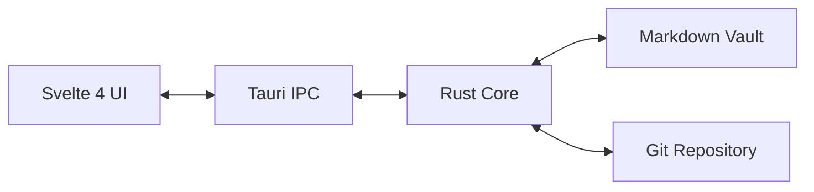

# Cabbage

Cabbage is a local-first, cross-platform desktop application for personal knowledge management. It stores all notes as plain Markdown files inside a Git repository, giving you versioning, offline use, and full data portability — no proprietary database, no cloud account, no vendor lock-in.

## How It Works

A **vault** is simply a local directory on your file system. Open any folder in Cabbage and it becomes your vault — if it is not already a Git repository, Cabbage runs `git init` automatically.

Notes are standard `.md` files. As you edit, Cabbage saves your changes and silently commits them to the local repository. Syncing with another machine is a regular `git push` and `git pull --rebase` against any remote you configure (GitHub, GitLab, a self-hosted server — anything that speaks Git over SSH or HTTPS).

## Features

- Markdown editor with syntax highlighting, line wrapping, and `[[wiki-link]]` navigation — Ctrl/Cmd+click follows links and creates missing notes
- Auto-save (1.5 s debounce) with automatic local Git commits
- Full-text search (Ctrl+P) — fuzzy matching over filenames and content with result snippets
- Backlinks panel — shows which notes link to the currently open note
- Note history — browse previous versions of any note, preview, and restore
- Graph view — force-directed canvas showing all notes and their `[[wiki-link]]` connections; pan, zoom, and click to navigate
- One-click sync with any Git remote (fetch, rebase, push)
- Vault persists between sessions — reopens automatically on launch
- Dark theme — auto-detects system preference, toggleable from the Settings dropdown

## Architecture



The UI communicates with the Rust backend through Tauri IPC. The backend handles file system, Git, and search operations.

## Roadmap

Phase 1 and Phase 2 are complete. See [PLAN.md](PLAN.md) for the full roadmap.

## Local Development

**Prerequisites:** Rust toolchain, Node.js (v22+), pnpm, Git, and the [Tauri v2 system dependencies](https://v2.tauri.app/start/prerequisites/) for your OS.

```bash
git clone https://github.com/moloo4ni/cabbage.git
cd cabbage
pnpm install
pnpm tauri dev

# Build a release binary
pnpm tauri build
```

## License

MPL 2.0 — see [LICENSE](LICENSE).

## Disclaimer

Cabbage does not track user metrics, require registration, or communicate with any external servers other than the Git remotes you configure yourself. Everything runs locally on your machine.
