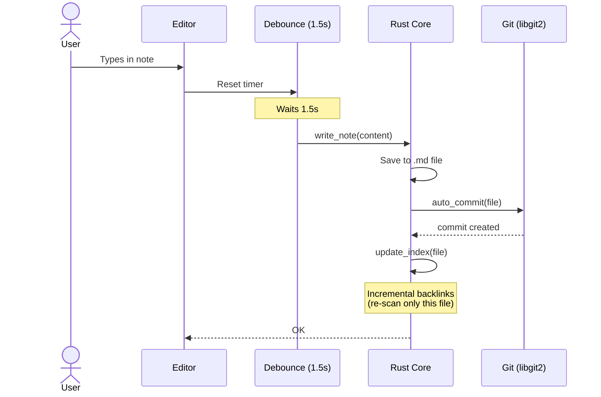
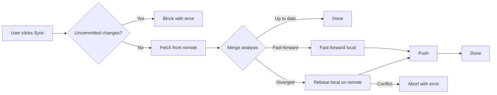

# Cabbage

Cabbage is a local-first, cross-platform desktop application for personal knowledge management. It stores all notes as plain Markdown files inside a Git repository, giving you versioning, offline use, and full data portability — no proprietary database, no cloud account, no vendor lock-in.

## How It Works

A **vault** is simply a local directory on your file system. Open any folder in Cabbage and it becomes your vault — if it is not already a Git repository, Cabbage runs `git init` automatically.

Notes are standard `.md` files. As you edit, Cabbage saves your changes and silently commits them to the local repository. Syncing with another machine is a regular `git push` and `git pull --rebase` against any remote you configure (GitHub, GitLab, a self-hosted server — anything that speaks Git over SSH or HTTPS).

## Features

### Core editing

- CodeMirror 6 editor with Markdown syntax highlighting, line wrapping, minimal theme
- `[[wiki-links]]` highlighted inline; Ctrl/Cmd+click navigates to the linked note (creates it if it does not exist)
- Auto-save with a 1.5 s debounce — every save triggers an automatic local Git commit
- Full-text search (Ctrl+P / Cmd+P) — fuzzy matches filenames (priority) and content with snippets, up to 20 results
- Incremental backlinks panel — notes that link to the current note, rebuilt per-file instead of full tree scan
- Note history — browse up to 50 commits for the active note, preview any version, restore with one click

### Vault & sync

- Open a vault via native folder-picker; last vault is persisted and reopens automatically on launch
- File tree sidebar — browse, create, and delete notes
- Sync button runs fetch, fast-forward or rebase, and push — all via native libgit2 (no `git` binary required) with progress events
- Git is optional — vaults work without a remote

### Graph view

- Canvas-based force-directed graph of all notes and `[[wikilink]]` connections
- Pan, zoom, and click to navigate

### UI polish

- Dark theme (GitHub Dark palette), auto-detects `prefers-color-scheme`, toggleable from Settings dropdown
- Loading indicators for slow operations (file open, tree refresh, graph load, note create/delete)
- Inline error bar for failed operations

## Architecture

```mermaid
graph TB
  subgraph Frontend["Frontend (Svelte 4)"]
    Editor["Editor (CodeMirror 6)"]
    Graph["Graph View (Canvas)"]
    Sidebar["Sidebar, Search, History"]
  end
  subgraph Bridge["Bridge (Tauri v2 IPC)"]
    Commands["Commands (13 Tauri commands)"]
  end
  subgraph Core["Core (Rust)"]
    FS["File System (walkdir, regex)"]
    Git["Git (libgit2 / git2)"]
    Index["Search & Backlinks Index"]
  end

  Editor -->|invoke()| Commands
  Graph -->|invoke()| Commands
  Sidebar -->|invoke()| Commands
  Commands -->|async| FS
  Commands -->|async| Git
  Commands -->|async| Index
```

The application is structured as a decoupled system:

- **Frontend (Svelte 4):** Handles UI rendering and user interactions. Holds no persistent state — everything is fetched from the Rust core via IPC. Editor is CodeMirror 6 with a custom `[[wiki-link]]` extension. Icons from `lucide-svelte`.
- **Bridge (Tauri v2 IPC):** Secure communication channel between the Svelte webview and the native system.
- **Core (Rust):** File system operations, native Git operations via `git2` (libgit2 bindings), and full-text search via file-tree walk on query.

### Auto-save flow



### Sync flow



## Roadmap

See [PLAN.md](PLAN.md) for the full 3-phase breakdown.

Phase 1 (Stability) and Phase 2 (Core Features) are complete. Phase 3 (Power Features) tracks future work: note templates, quick preview, settings UI, file attachments, tag index, export, and plugin system.

## Local Development

**Prerequisites:** Rust toolchain, Node.js (v22+), pnpm, Git, and the [Tauri v2 system dependencies](https://v2.tauri.app/start/prerequisites/) for your OS.

```bash
git clone https://github.com/moloo4ni/cabbage.git
cd cabbage
pnpm install
pnpm tauri dev
```

**Build a release binary:**

```bash
pnpm tauri build
# Output: src-tauri/target/release/bundle/
```

## License

MPL 2.0 — see [LICENSE](LICENSE).

## Disclaimer

Cabbage does not track user metrics, require registration, or communicate with any external servers other than the Git remotes you configure yourself. Everything runs locally on your machine.
